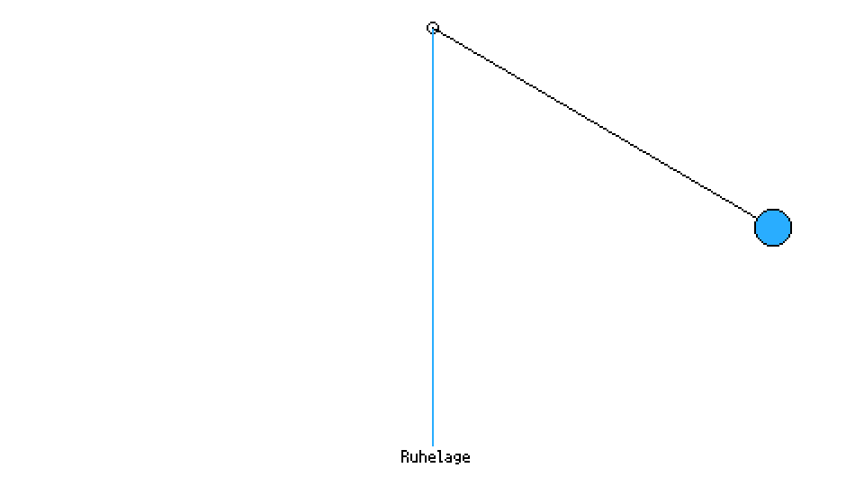

ℹ️ Wenn wir Musik hören wollen, muss sich zuerst etwas bewegen, denn Musik ist eine besondere Art der Bewegung, die wir **Schwingung** nennen. Um zu verstehen was Schwingung ist, schauen wir uns ein schwingendes Pendel an:

Pendel anzeigen

Pendel 
 

Viele Dinge in unserer Welt schwingen – nicht nur Musikinstrumente:  
Eine Schaukel auf dem Spielplatz, Bäume im Wind, die Luft beim Sprechen, unser Herz beim Schlagen, elektrische Signale im Handy, Wellen auf dem Wasser, Erdbeben, Licht (auch Licht ist eine Art Schwingung!)

💡 Musik ist also Teil eines viel größeren Naturphänomens. Wir Menschen sind selbst schwingende Wesen – deshalb wirkt Musik so stark auf uns.

🧪Lass uns dass Phänomen Schwingung mit Hilfe des Pendels genauer unteruchen: <ins>[Pendel](https://fpiesik.github.io/musikbuch/animationen/pendel/)</ins>

✍️ Was passiert jeweils mit der Schwingung, wenn du die Regler "Länge", "Startwinkel" und "Dämpfung" verstellst?
✍️ Schaue dir die Bewegung des Pendels genau an und beschreibe sie.

<iframe src="https://www.lexaloffle.com/bbs/widget.php?pid=starmap3d" allowfullscreen width="961" height="541" style="border:none; overflow:hidden"></iframe>

<iframe
  src="../animationen/pendel/"
  allowfullscreen
  width="480"
  height="270"
  scrolling="no"
  style="border:none; overflow:hidden; transform: translateX(+12px);"
></iframe>

  <iframe
    src="../animationen/pendel/"
    allowfullscreen
    scrolling="no"
    style="width:100%; height:100%; border:none; overflow:hidden;"
  ></iframe>

  <iframe
    src="../animationen/pendel/"
    style="
      width:70%;
      height:70%;
      border:none;
      transform: translateX(-12px);"
    allowfullscreen
    scrolling="no"
  ></iframe>

  <iframe
    src="../animationen/pendel/"
    style="
      width:80%;
      height:70%;
      border:none;
      transform: translateX(-12px);"
    allowfullscreen
    scrolling="no"
  ></iframe>

  <iframe
    src="../animationen/pendel/"
    style="
      width:71%;
      height:70%;
      border:none;
      transform: translateX(-9px);
      "
    allowfullscreen
    scrolling="no"
  ></iframe>

