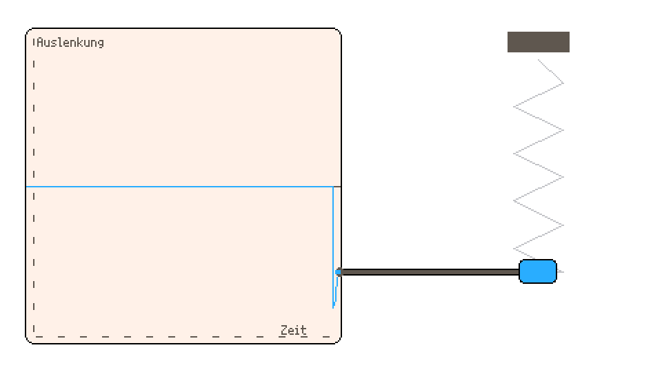

Wie wir an dem Pendel beobachten konnten, ist eine Schwingung *eine regelmäßige Hin-und-her-Bewegung um eine **Ruhelage***.

**Eine einfache Schwingung drei Eigenschaften:**

- **Amplitude** – wie stark schwingt etwas?
- **Frequenz** – wie schnell schwingt etwas?
- **Dämpfung** – wie schnell klingt die Schwingung aus?

🧪Lerne diese Eigenschaften mit Hilfe der Feder-Maschine besser kennen: 

  <iframe
    src="../animationen/federmaschine/"
    style="
      width:88%;
      height:75%;
      border:none;
      transform: translateX(-50px);
      "
    allowfullscreen
    scrolling="no"
  ></iframe>

<iframe src="../animationen/schallausbreitung/" allowfullscreen style="border:none; overflow:hidden; width:600px; height:300px; margin:auto"></iframe>

Das Oszilloskop

Wie du siehst, kann man Schwingungen auch aufzeichnen. Zum Beispiel, indem man einen Stift an einem schwingenden Körper (die Feder) befestigt, ein Papier darunter legt und langsam daran zieht. Die Federmaschine macht im Grunde genau das. So entsteht ein so genannter Graph, der den zeitlichen Verlauf der Schwingung zeigt. Geräte, die Schwingungen aufzeichnen und anzeigen können, nennt man **Oszilloskop** – ein Messgerät, dass uns in hier noch of begegnen wird.

 

