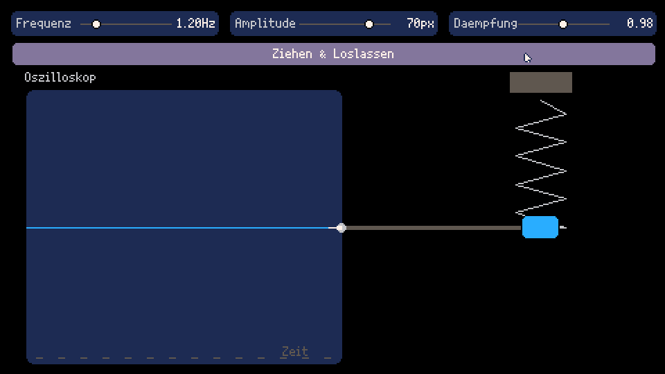

## 1\. Alles beginnt mit Bewegung

Musik kann man nicht sehen, sie entsteht aber nicht aus dem Nichts. Bevor wir einen Ton hören können, muss sich etwas **bewegen**. Diese besondere Art der Bewegung nennt man **Schwingung**.

Eine **Schwingung** ist eine regelmäßige Hin-und-her-Bewegung um eine **Ruhelage**, einen Mittelpunkt.

Viele Dinge in unserer Welt schwingen – nicht nur Musikinstrumente:

- eine Schaukel auf dem Spielplatz
    
- Bäume im Wind
    
- die Luft beim Sprechen
    
- unser Herz beim Schlagen
    
- elektrische Signale im Handy
    

👉 Musik ist also Teil eines viel größeren Naturphänomens.

* * *

## 2\. Was genau ist eine Schwingung?

Stell dir eine Feder vor, an der ein Gewicht hängt. Ziehst du das Gewicht nach unten und lässt los, bewegt es sich immer wieder nach oben und unten.

**Für die Musik sind vor allem drei Eigenschaften einer Schwingung wichtig:**

- **Amplitude** – wie stark schwingt etwas?
    
- **Frequenz** – wie schnell schwingt etwas?
    
- **Dämpfung** – wie lange klingt die Schwingung?
    
- **Auslenkung** - wie ist der schwingende Körper gerade von seiner Ruhelage entfernt?
    

Diese drei Eigenschaften begegnen uns im ganzen Musikunterricht immer wieder. Lerne sie mit Hilfe der [Federmaschine](https://fpiesik.github.io/musikbuch/animationen/federmaschine/) besser kennen!

Wie du siehst, kann man Schwingungen auch aufzeichnen. Zum Beispiel, indem man einen Stift an einem schwingenden Körper befestigt, ein Papier darunter legt und langsam daran zieht. Die Federmaschine macht im Grunde genau das. So entsteht ein so genannter Graph, der den zeitlichen Verlauf der Schwingung zeigt. Geräte, die Schwingungen aufzeichnen und anzeigen können, nennt man **Oszilloskop**.

* * *

## 3\. Schwingungen überall

### Schwingungen in der Natur

- Wellen auf dem Wasser
    
- Erdbeben
    
- Wind
    
- Licht (auch Licht ist eine Art Schwingung!)
    

### Schwingungen im Körper

- Herzschlag
    
- Atmung
    
- Stimme
    
- Zittern bei Kälte oder Aufregung
    

👉 Wir Menschen sind selbst schwingende Wesen – deshalb wirkt Musik so stark auf uns.

* * *

## 4\. Schall – wenn Schwingung hörbar wird

Wenn etwas schwingt, kann es die **Luft** in Bewegung versetzen. Diese Bewegung breitet sich als **Schallwelle** aus.

Wichtig:

- Die Luft fliegt nicht von der Schallquelle zu unserem Ohr.
    
- Stattdessen wird die Schwingung von Luftteilchen zu Luftteilchen weitergegeben.
    

Unser Ohr kann Schwingungen ungefähr zwischen **20 und 20.000 Schwingungen pro Sekunde (Hertz)** hören.

* * *

## 5\. Tonhöhe – schnell oder langsam?

In der Musik nennen wir die Frequenz eines Tons **Tonhöhe**:

- langsame Schwingung → tiefer Ton
    
- schnelle Schwingung → hoher Ton
    

Das gilt für alle Instrumente:

- lange, dicke Saiten → tiefe Töne
    
- kurze, dünne Saiten → hohe Töne
    

👉 Ob ein Ton hoch oder tief klingt, entscheidet die **Geschwindigkeit der Schwingung**.

* * *

## 6\. Warum ein Ton nie allein schwingt – die Obertöne

Wenn eine Saite schwingt, schwingt sie nicht nur als Ganzes.

Gleichzeitig schwingen auch:

- die halbe Saite
    
- ein Drittel der Saite
    
- ein Viertel der Saite
    

So entstehen **mehrere Töne gleichzeitig**. Diese nennt man **Obertöne**.

Der tiefste Ton heißt **Grundton**. Die Obertöne liegen darüber.

👉 Zusammen ergeben sie den **Klang** eines Instruments.

* * *

## 7\. Warum Dur so vertraut klingt

Aus den ersten Obertönen entstehen automatisch bekannte musikalische Abstände:

- Oktave
    
- Quinte
    
- große Terz
    

Diese Töne bilden zusammen einen **Dur-Dreiklang**.

👉 Dur wurde nicht erfunden, sondern in der Natur der Schwingung entdeckt.

* * *

## 8\. Resonanz – wenn Schwingung stärker wird

Manche Dinge beginnen besonders stark zu schwingen, wenn sie mit der richtigen Frequenz angeregt werden. Das nennt man **Resonanz**.

Beispiele:

- eine Schaukel
    
- der Körper einer Gitarre
    
- eine Trommel
    
- unsere Brust beim Singen
    

Instrumente sind **Resonanzkörper**, die Schwingungen verstärken.

* * *

## 9\. Klangfarbe – warum Instrumente unterschiedlich klingen

Ein Ton auf der Flöte klingt anders als derselbe Ton auf dem Klavier.

Der Grund:

- Jedes Instrument hat **eigene Obertöne**
    
- Die Mischung der Obertöne nennt man **Klangfarbe**
    

👉 Klangfarbe ist wie ein akustischer Fingerabdruck.

* * *

## 10\. Musik – geordnete Schwingung

Nicht jede Schwingung ist Musik.

Musik entsteht, wenn Menschen Schwingungen:

- auswählen
    
- ordnen
    
- wiederholen
    
- gestalten
    

**Merksatz:**

> Musik ist bewusst geordnete Schwingung in der Zeit.
